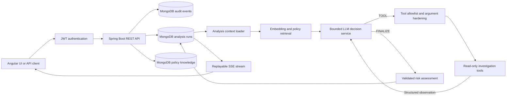
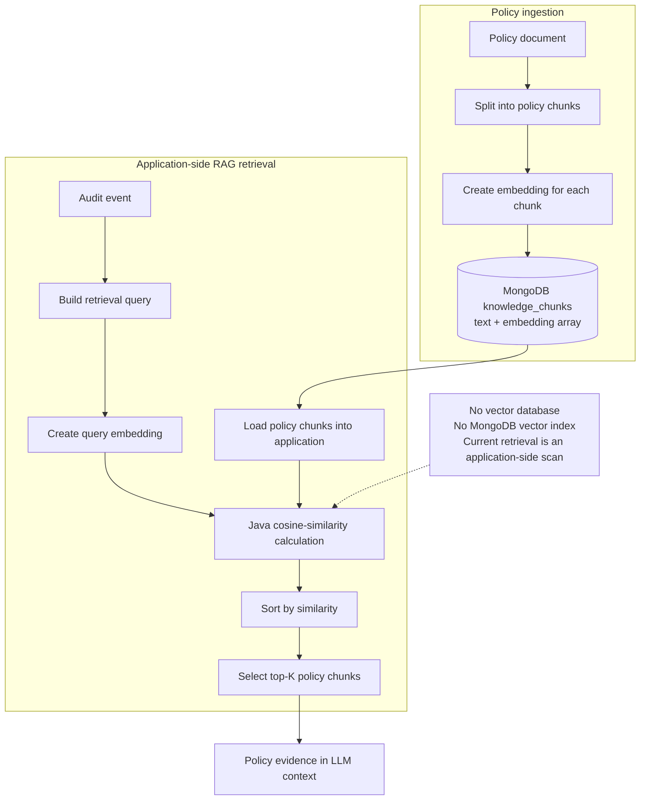
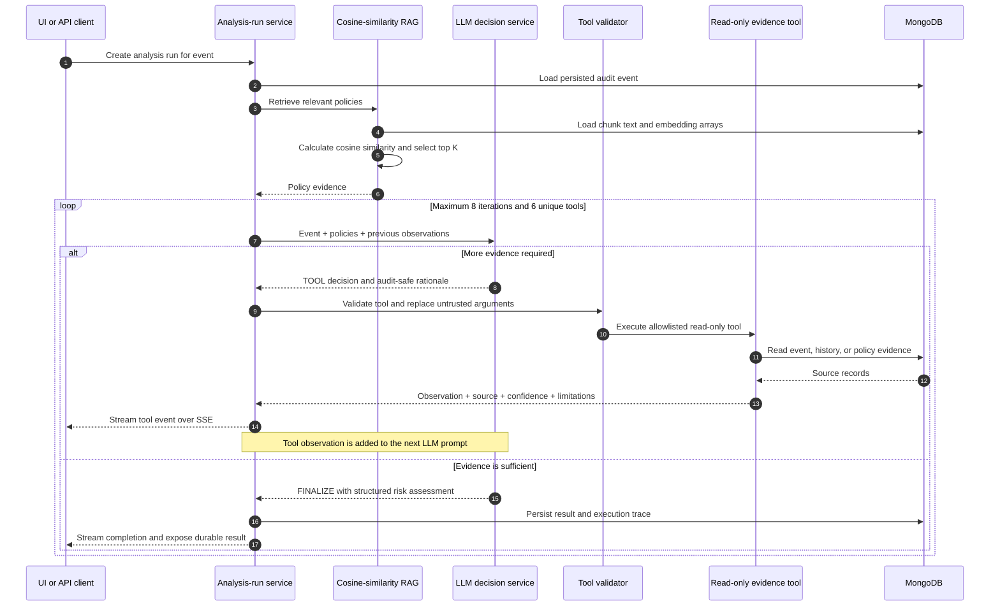

# Agentic AI Audit Analysis Service

An audit intelligence backend that combines Spring Boot, Spring AI, OpenAI,
MongoDB, retrieval-augmented generation (RAG), JWT authorization, and a bounded
LLM-directed investigation loop.

The service accepts enterprise audit events, retrieves relevant policy evidence,
allows the LLM to request read-only investigation tools, streams progress over
Server-Sent Events (SSE), and persists a final evidence-backed risk assessment.

> **Project status:** production-oriented reference implementation. The core
> workflows, security boundaries, persistence, and tests are implemented.
> Review [Production Readiness](#production-readiness) before deploying it in a
> regulated or high-availability environment.

## Why This Project Exists

Traditional audit rules are effective for known patterns but struggle when an
event contains conflicting signals. A successful privileged action may also
involve an unmanaged device, unusual geography, missing approval, sensitive
data, and disabled controls.

This project treats an audit investigation as a bounded evidence-gathering
process:

1. Persist the raw event.
2. Retrieve relevant policy evidence.
3. Ask the LLM whether more evidence is required.
4. Execute only allowlisted, read-only tools.
5. Return each observation to the LLM.
6. Repeat within strict iteration and tool-call limits.
7. Persist and stream the final assessment and execution trace.

The LLM does not execute arbitrary code, choose a different subject, mutate
systems, or receive unrestricted tool access.

## Key Capabilities

- **LLM-directed investigation:** the model selects the next relevant evidence
  tool instead of receiving a fixed, preselected tool sequence.
- **Bounded orchestration:** maximum 8 reasoning iterations and 6 unique tool
  calls per run.
- **Policy-grounded RAG:** policy documents are chunked, embedded, stored in
  MongoDB, and retrieved for each event.
- **15 read-only investigation tools:** identity, authentication, behavior,
  event timelines, assets, network, sessions, authorization, data exposure,
  policy search, control coverage, and threat indicators.
- **Evidence provenance:** tool records include source, confidence, evidence
  identifiers, limitations, duration, input summary, and output summary.
- **Persisted asynchronous runs:** analysis continues independently of the
  initiating HTTP request and records `PENDING`, `RUNNING`, `COMPLETED`, or
  `FAILED`.
- **Replayable live progress:** SSE subscribers receive buffered events first,
  followed by new events as the investigation proceeds.
- **JWT and RBAC:** stateless bearer authentication with endpoint-level role
  authorization.
- **Real dashboard analytics:** metrics, recent activity, insights, and engine
  status are calculated from backend data.
- **OpenAPI documentation:** Swagger UI includes bearer-token authorization and
  endpoint descriptions.
- **Operational visibility:** Actuator health endpoints and persisted
  diagnostics are available.

## Architecture



## RAG and ReAct Design

This project uses RAG, but it does **not** currently use a vector database or a
database-native vector index.

Policy documents and their embedding arrays are stored as ordinary MongoDB
documents. During retrieval, the service loads the stored policy chunks,
creates an embedding for the audit-event query, calculates cosine similarity in
the Java application, sorts the chunks by similarity, and selects the top
matches.



The current retrieval method is intentionally simple and transparent:

```text
query embedding
    -> load all stored chunk embeddings
    -> cosineSimilarity(queryEmbedding, chunkEmbedding)
    -> sort descending
    -> return top K
```

This is suitable for development, demonstrations, evaluation, and modest policy
collections. Its retrieval cost grows linearly with the number of chunks, and
the application performs the similarity calculation and sorting. For a large
production corpus, migrate to MongoDB Atlas Vector Search, PostgreSQL with
`pgvector`, OpenSearch, Pinecone, Weaviate, Milvus, or another indexed vector
retrieval system.

After the initial policy retrieval, the investigation uses a bounded ReAct-style
cycle: the LLM evaluates the available evidence, chooses an action, receives an
observation, and evaluates the updated context again.



This is a controlled ReAct implementation rather than unrestricted autonomous
tool calling:

- the LLM chooses only between `TOOL` and `FINALIZE`;
- only catalogued read-only tools may execute;
- actor, target, event, and bounded time-window arguments are enforced by the
  backend;
- duplicate tool calls are rejected;
- every observation is recorded before it is returned to the LLM;
- execution stops at the configured iteration or tool-call limit;
- incomplete runs produce an explicit fallback assessment for manual review.

## Investigation Loop

Each iteration sends the LLM:

- the persisted audit event;
- retrieved policy chunks;
- previous tool observations;
- the current and maximum iteration numbers;
- the allowlisted tool catalog and behavioral constraints.

The model must return one structured decision:

```json
{
  "action": "TOOL",
  "decision": "continue",
  "thought": "Authorization evidence is required.",
  "toolRequest": {
    "toolName": "getAuthorizationContext",
    "toolArgs": {}
  },
  "finalResponse": null
}
```

The server validates the tool name and replaces untrusted model arguments with
values derived from the persisted event. The tool result is recorded as an
observation and included in the next LLM request. When evidence is sufficient,
the model returns `FINALIZE` with the risk assessment.

The streamed `thought` value is an audit-safe rationale summary, not hidden
chain-of-thought.

## Investigation Tools

| Tool | Evidence produced |
| --- | --- |
| `getUserActivitySummary` | Historical successes, failures, actions, and targets |
| `getFailedLoginCount` | Failed authentication count for the actor |
| `getRecentEvents` | Recent actor event history |
| `getIdentityRiskProfile` | Identity state, employment, roles, privilege, MFA, and break-glass data |
| `getAuthenticationRisk` | Authentication method, MFA outcome, credential age, and historical failures |
| `getBehavioralBaseline` | Whether actions, targets, times, and locations match historical behavior |
| `getRelatedEventSequence` | Bounded timeline around the actor and target |
| `getAssetRiskProfile` | Asset criticality, environment, ownership, and data classification |
| `getNetworkRiskContext` | IP, geography, VPN, proxy, TOR, reputation, and travel signals |
| `getSessionRiskContext` | Session, device, token, user-agent, and concurrency evidence |
| `getAuthorizationContext` | Approval, ticket, entitlement, maintenance window, and segregation-of-duties data |
| `getDataExposureContext` | Export volume, destination, sensitivity, encryption, and DLP evidence |
| `searchApplicablePolicies` | Policy chunks relevant to the event |
| `getControlCoverage` | Preventive, detective, and compensating control signals |
| `getThreatIndicatorContext` | Event-enriched threat intelligence and explicit provider limitations |

All tools are read-only. Missing data is reported as an explicit limitation and
is never interpreted as proof that risk is absent.

## Technology Stack

- Java 21
- Spring Boot 3.5
- Spring AI 1.0
- OpenAI chat and embedding models
- Spring Security OAuth2 Resource Server
- JWT with HS256 signing
- MongoDB and Spring Data MongoDB
- Server-Sent Events
- Springdoc OpenAPI / Swagger UI
- Gradle
- JUnit 5, AssertJ, and Mockito

## Prerequisites

- JDK 21
- MongoDB 7 or a MongoDB Atlas cluster
- An OpenAI API key
- Node.js 18 or newer only if using the policy seed script

## Configuration

Use environment variables for secrets. Do not commit API keys, database
credentials, JWT secrets, or production passwords.

### PowerShell

```powershell
$env:SPRING_AI_OPENAI_API_KEY="your-openai-api-key"
$env:SPRING_DATA_MONGODB_URI="mongodb://localhost:27017/audit_platform"
$env:SPRING_DATA_MONGODB_DATABASE="audit_platform"
$env:APP_SECURITY_JWT_SECRET="replace-with-a-random-secret-of-at-least-32-bytes"
$env:APP_SECURITY_USERNAME="analyst"
$env:APP_SECURITY_PASSWORD="replace-the-development-password"
```

Spring Boot relaxed binding maps `SPRING_AI_OPENAI_API_KEY` to
`spring.ai.openai.api-key` and the MongoDB variables to their corresponding
Spring properties.

For production, supply every user credential from a secret manager or replace
the in-memory identity store with an external identity provider.

## Run Locally

```powershell
git clone https://github.com/Shibaji1987/spring-ai-service.git
cd spring-ai-service
.\scripts\initialize-mongodb.ps1
.\gradlew bootRun
```

The API starts on `http://localhost:8080` by default.

Useful links:

- Swagger UI: http://localhost:8080/swagger-ui/index.html
- OpenAPI JSON: http://localhost:8080/v3/api-docs
- Health: http://localhost:8080/actuator/health

## Initialize MongoDB

MongoDB creates collections automatically on first write, but the repository
also provides an explicit, idempotent bootstrap for repeatable local and hosted
environments.

The script creates:

- `audit_events`
- `audit_ai_analysis`
- `audit_analysis_runs`
- `knowledge_documents`
- `knowledge_chunks`

It also creates indexes for actor and event timelines, dashboard analysis
queries, run status, policy catalog browsing, and document-to-chunk lookup.

### PowerShell wrapper

Local MongoDB:

```powershell
.\scripts\initialize-mongodb.ps1
```

Custom connection:

```powershell
.\scripts\initialize-mongodb.ps1 `
  -MongoUri "mongodb://localhost:27017" `
  -Database "audit_platform"
```

The wrapper also reads `SPRING_DATA_MONGODB_URI` and
`SPRING_DATA_MONGODB_DATABASE` when parameters are omitted.

### Run with mongosh directly

```powershell
$env:MONGODB_DATABASE="audit_platform"
mongosh "mongodb://localhost:27017" `
  --file scripts/initialize-mongodb.js
```

The bootstrap is safe to run repeatedly. It does not delete collections or
documents.

> The script deliberately creates no vector index. The `embedding` field in
> `knowledge_chunks` remains a normal numeric array, and the application
> performs cosine-similarity retrieval in Java.

## Authentication

Development users are backed by Spring Security's in-memory user store.

| Role | Default username | Intended access |
| --- | --- | --- |
| `ADMIN` | `admin` | Full platform access |
| `POLICY_MANAGER` | `policy-manager` | Read data and manage policy documents |
| `ANALYST` | `analyst` | Submit events and create investigations |
| `VIEWER` | `viewer` | Read-only dashboards, events, policies, and results |

Development passwords are defined as overridable defaults in
`SecurityConfig`. Rotate all credentials before sharing or deploying an
instance.

Login:

```bash
curl -X POST "http://localhost:8080/auth/login" \
  -H "Content-Type: application/json" \
  -d '{"username":"analyst","password":"Analyst@12345"}'
```

Copy `accessToken` from the response. In Swagger, click **Authorize** and enter
the token. Swagger's bearer dialog accepts the raw JWT; curl requests require
the `Bearer` prefix:

```bash
-H "Authorization: Bearer YOUR_JWT"
```

## Recommended API Workflow

### 1. Submit an audit event

```bash
curl -X POST "http://localhost:8080/audit/event" \
  -H "Authorization: Bearer YOUR_JWT" \
  -H "Content-Type: application/json" \
  -d '{
    "eventType": "PRIVILEGED_DATA_EXPORT",
    "actor": "analyst@bank.com",
    "action": "EXPORT_CUSTOMER_DATA",
    "target": "Core-Banking-Production",
    "status": "SUCCESS",
    "metadata": {
      "assetCriticality": "TIER_0",
      "dataClassification": "RESTRICTED",
      "ipAddress": "185.220.101.42",
      "tor": true,
      "approved": false,
      "recordCount": 2500000,
      "encrypted": false,
      "auditDisabled": true
    }
  }'
```

Copy the returned event identifier.

### 2. Create one persisted analysis run

```bash
curl -X POST \
  "http://localhost:8080/audit/events/EVENT_ID/analysis-runs" \
  -H "Authorization: Bearer YOUR_JWT" \
  -H "Content-Type: application/json" \
  -d '{}'
```

The endpoint returns HTTP `202 Accepted`:

```json
{
  "analysisRunId": "RUN_ID",
  "eventId": "EVENT_ID",
  "status": "PENDING",
  "streamUrl": "/audit/analysis-runs/RUN_ID/stream",
  "resultUrl": "/audit/analysis-runs/RUN_ID"
}
```

### 3. Observe live progress

```bash
curl -N \
  "http://localhost:8080/audit/analysis-runs/RUN_ID/stream" \
  -H "Authorization: Bearer YOUR_JWT"
```

The stream replays buffered events before continuing with live updates.
Typical phases include:

- `POLICY_RETRIEVAL`
- `LLM_DECISION`
- `TOOL_REQUESTED`
- `TOOL_EXECUTION`
- `AI_REASONING`
- `ANALYSIS_COMPLETED`
- `ANALYSIS_FAILED`

### 4. Retrieve durable status or result

```bash
curl "http://localhost:8080/audit/analysis-runs/RUN_ID" \
  -H "Authorization: Bearer YOUR_JWT"
```

Use this endpoint for polling, reconnect recovery, automation, or retrieving a
completed result after the SSE connection closes.

## API Overview

| Area | Endpoint | Purpose |
| --- | --- | --- |
| Authentication | `POST /auth/login` | Issue a JWT |
| Events | `POST /audit/event` | Persist an audit event |
| Events | `GET /audit/events` | List audit events |
| Analysis | `POST /audit/events/{eventId}/analysis-runs` | Create one asynchronous investigation |
| Analysis | `GET /audit/analysis-runs/{runId}/stream` | Replay and stream progress |
| Analysis | `GET /audit/analysis-runs/{runId}` | Read durable status or final result |
| Knowledge | `POST /knowledge/documents` | Ingest policy knowledge |
| Knowledge | `GET /knowledge/documents` | Browse the policy catalog |
| Knowledge | `GET /knowledge/search` | Search embedded policy chunks |
| Dashboard | `GET /dashboard/summary` | Retrieve the combined dashboard view |
| Dashboard | `GET /dashboard/metrics` | Retrieve calculated metrics |
| Dashboard | `GET /dashboard/recent-activity` | Retrieve recent audit activity |
| Dashboard | `GET /dashboard/insights` | Retrieve generated operational insights |
| Dashboard | `GET /dashboard/engine-status` | Retrieve service and model status |

Older `/analyze-with-tools` and `/analyze-with-llm-tools` routes remain for
compatibility but are deprecated. New clients should use the persisted
analysis-run lifecycle.

## Seed 500 Policies

The repository includes a deterministic synthetic enterprise policy corpus:

```powershell
node scripts/seed-knowledge-policies.mjs `
  --base-url=http://localhost:8080 `
  --username=policy-manager `
  --password=Policy@12345
```

Use `--dry-run` to generate and validate the corpus without sending requests.
The seed data spans identity, privileged access, data protection, networking,
cloud, payments, privacy, production operations, APIs, and third-party risk.

The seed script is for development and demonstrations. Replace synthetic
policies with approved organizational documents for real deployments.

## Persistence Model

Primary MongoDB collections:

- `audit_events`: source audit events and metadata;
- `audit_ai_analysis`: persisted analysis results and diagnostics;
- `audit_analysis_runs`: lifecycle state, buffered SSE events, errors, and final
  result;
- `knowledge_documents`: source policy documents;
- `knowledge_chunks`: embedded chunks used for retrieval.

## Security Model

- Stateless JWT bearer authentication
- BCrypt password hashing
- Method-level RBAC with `@PreAuthorize`
- Server-side tool allowlist
- Event-scoped tool arguments
- Read-only investigation tools
- Duplicate-tool rejection
- Bounded iterations and calls
- Prompt-injection instructions for untrusted event, policy, and tool data
- Explicit fallback result when an investigation cannot complete
- Persisted execution trace for auditability

The service deliberately streams concise rationale summaries rather than
private model chain-of-thought.

## Testing

Run the complete backend suite:

```powershell
$env:JAVA_HOME="C:\Program Files\Eclipse Adoptium\jdk-21.0.10.7-hotspot"
.\gradlew test
```

Build the application:

```powershell
.\gradlew clean build
```

Tests cover security configuration, JWT role mapping, tool-decision validation,
bounded orchestration, policy catalog behavior, and persisted analysis runs.

## Production Readiness

### Implemented production-oriented foundations

- Clear API lifecycle separating creation, observation, and retrieval
- Durable MongoDB run and result persistence
- Replayable progress events
- Stateless authentication and role authorization
- Bounded and allowlisted tool execution
- Evidence provenance and limitations
- Structured model responses and response validation
- Fallback behavior and diagnostics
- Health endpoints, OpenAPI documentation, and automated tests

### Required before a serious production deployment

1. **External identity:** replace in-memory users and shared-secret JWT signing
   with OIDC/OAuth2 through Entra ID, Okta, Keycloak, or another enterprise IdP.
2. **Durable execution:** move background work to a queue or workflow engine
   such as Kafka, RabbitMQ, Temporal, or a managed task service. The current
   executor is process-local.
3. **Distributed streaming:** publish progress through a durable event bus so
   any application instance can serve reconnecting SSE clients.
4. **Secret management:** use Vault, AWS Secrets Manager, Azure Key Vault, or
   GCP Secret Manager and enforce rotation.
5. **Live connectors:** integrate authoritative IAM, PAM, CMDB, ticketing, DLP,
   SIEM, EDR, and threat-intelligence systems. Current enriched tools primarily
   use audit-event metadata and stored history.
6. **Retrieval scale:** replace full in-memory chunk scanning with MongoDB Atlas
   Vector Search or another production vector index.
7. **Resilience:** add provider timeouts, retries with jitter, circuit breakers,
   concurrency controls, idempotency keys, and backpressure.
8. **Observability:** add OpenTelemetry traces, Micrometer metrics, structured
   security logs, dashboards, alerts, SLOs, and token/cost accounting.
9. **API protection:** add rate limits, payload limits, schema validation,
   tenant isolation, retention controls, and abuse monitoring.
10. **Evaluation:** maintain a versioned adversarial test corpus and measure
    precision, recall, false positives, grounding, tool selection, latency, and
    cost before model or prompt releases.
11. **Governance:** add human approval for consequential actions, model and
    prompt versioning, evidence retention policies, and compliance review.
12. **Delivery:** add container images, deployment manifests, migrations,
    environment profiles, CI quality gates, dependency scanning, and SBOMs.

Until these items are addressed, position the project as a sophisticated
production-oriented prototype or reference architecture rather than a finished
regulated-production product.

## Suggested Roadmap

- Case management with assignment, comments, evidence pinning, and disposition
- Analyst feedback and false-positive labeling
- Investigation replay and side-by-side model comparison
- Explainable risk-score contribution breakdown
- Correlation across users, devices, IPs, sessions, assets, and campaigns
- Graph-based attack-path visualization
- MITRE ATT&CK technique mapping
- Notification and incident-platform integrations
- Policy versioning, approval workflows, and effective dates
- Multi-tenant data isolation and per-tenant model configuration
- Cost, latency, token, and tool-quality dashboards
- Automated regression evaluation for prompts, models, retrieval, and tools

## Repository Structure

```text
src/main/java/com/agentic/ai/spring_ai_service
|-- audit
|   |-- controller       REST and SSE endpoints
|   |-- dto              API and agent contracts
|   |-- model            MongoDB and analysis models
|   |-- orchestrator     bounded LLM/tool execution loop
|   |-- repository       MongoDB repositories and analytics
|   `-- tools            catalog, gateway, and evidence providers
|-- security             JWT authentication and RBAC
`-- service              analysis, retrieval, persistence, and dashboard logic

scripts
`-- seed-knowledge-policies.mjs
```

## Companion UI

The Angular frontend is maintained separately:

https://github.com/Shibaji1987/agentic-ai-audit-observability-ui

It provides authenticated event submission, dashboards, policy browsing,
analysis details, live reasoning phases, selected policy evidence, and tool
execution traces.

## Responsible Use

LLM output should support qualified analysts, not autonomously determine
employment, access, disciplinary, legal, or regulatory outcomes. Preserve source
evidence, expose uncertainty, require human review for consequential decisions,
and continuously evaluate model behavior against representative and adversarial
cases.

## License

The current OpenAPI metadata identifies this project for internal use. Add an
explicit repository license before distributing or accepting external
contributions.
